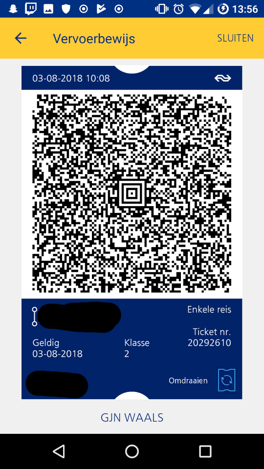
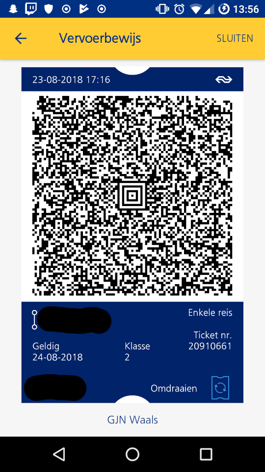

# rpxtix

rpxtix is an android application that displays NS train tickets in the way the the official NS app would allowing you to show tickets from you phone instead of having to print them or using the NS Reisplanner Xtra app.

Release builds on this page are signed with key 0A:4C:9E:37:63:24:D7:E9:E6:DC:D6:A0:3E:87:46:D4:57:52:3C:9F

## Why

According to the [official NS website](https://www.ns.nl/reisinformatie/ns-op-uw-mobiel/mobiele-tickets.html), when buying tickets online, tickets are only valid when they are printed on paper or used with the proprietary NS app.

The problem with this is that not everyone wants to install this app that also does a million other things besides just showing your tickets. The alternative (printing tickets) is not very convenient and is a waste of paper when just about everybody has a smartphone.

This app therefore does exactly the same as NS's app by showing the tickets in the same format, providing a flip button for showing the back side and turning up the brightness to 100% while the ticket is being shown to allow it to be scanned by QR readers.

## Usage

When the app is installed on the device, you can open `rpx://` protocol links just like the official app does when pressing the download button for your ticket.

This will download the ticket images (which are pre-rendered into a PDF with a front and a back face) and cache it on the device so it's available offline.

When launching the app from the application launcher you will be brought to a list where you can find all your tickets.

## Feature List

* [X] Download tickets
* [X] Store multiple tickets offline
* [ ] Remove tickets from manager (for now, clearing app data removes all tickets)

## Comparison

| NS Reisplanner Xtra   | rpxtix
|----------------|----------------
|  | 

It's not perfect yet, but it works :)

## Disclaimer

This application is not meant to enable ticket fraud, it is only meant to serve as an alterative to the NS Reisplanner Xtra app. I also provide no warranty that using this app will not get you in trouble or take any responsibility for you using it.